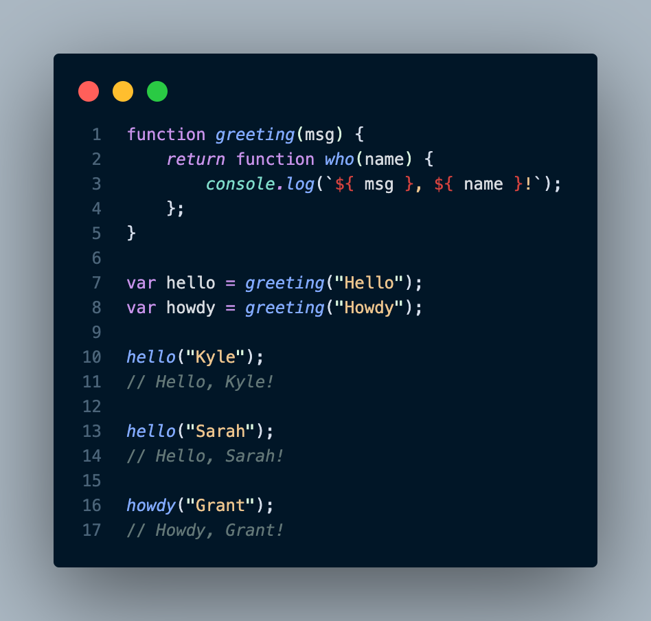
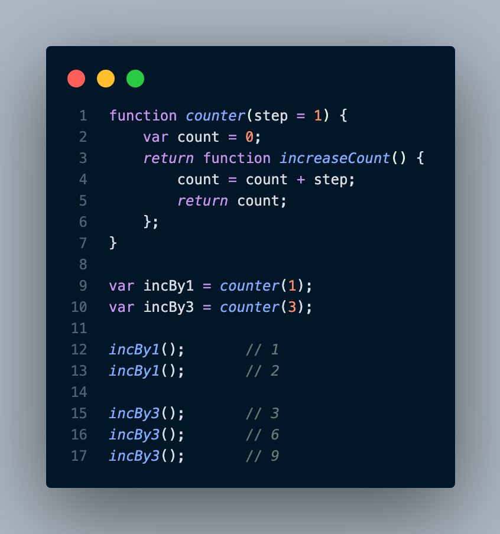
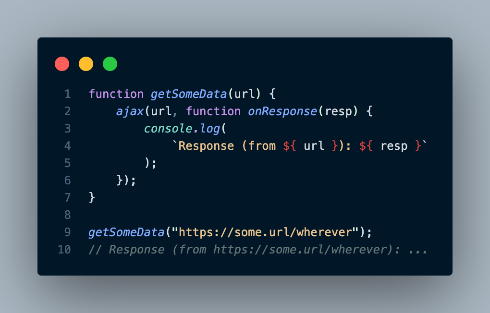
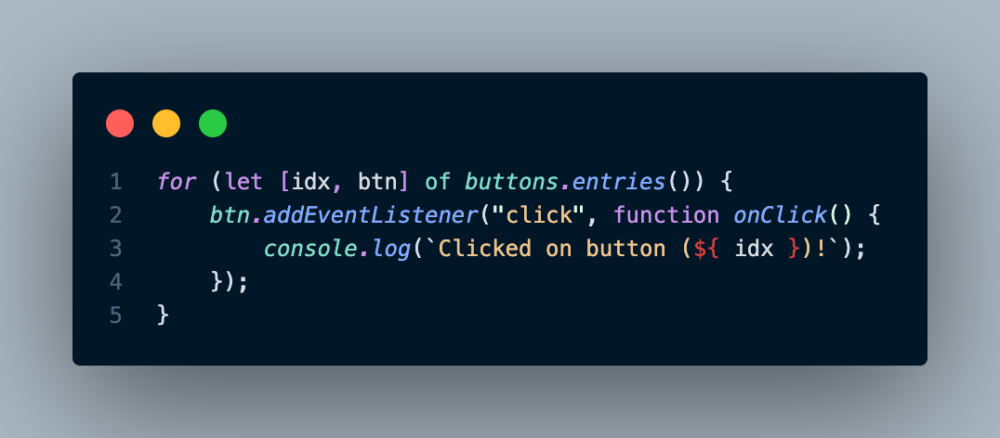
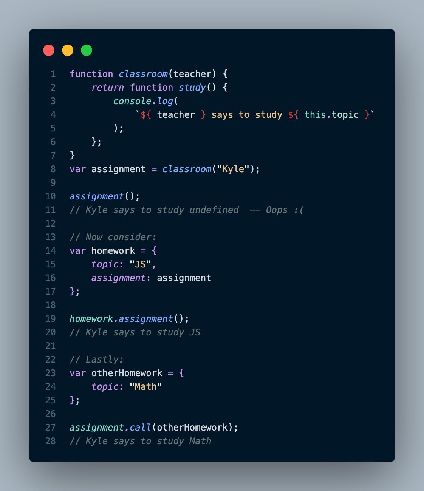

# Iteration
The paragraph discusses the importance of using the iterator pattern in programming to process data and make decisions based on it. This pattern suggests consuming data from a source one chunk at a time, rather than handling the entire set all at once. The iterator pattern defines an iterator data structure that has a reference to an underlying data source and exposes a method like next(), which returns the next piece of data. This approach makes the code cleaner and easier to understand, rather than having every data structure/source define its own custom way of handling data. The ES6 standardized a specific protocol for the iterator pattern that defines a next() method whose return is an object called an iterator result, which has value and done properties.

---
### Consuming Iterators
The paragraph describes the standardized mechanisms introduced in ES6 for consuming iterators in programming. The for..of loop is one such mechanism that allows looping over the results of an iterator one value at a time, making the code more readable than a manual loop. Another mechanism is the spread operator, which has two forms: spread and rest. The spread form is used for consuming iterators and can be used to spread the iterated values into an array or as arguments to a function call. In both cases, the spread operator follows the iterator-consumption protocol to retrieve all available values from an iterator and spread them into the receiving context.

---
### Iterables
This passage explains the iterator-consumption protocol and iterables in JavaScript. The protocol is used for consuming iterables, which are values that can be iterated over. When an iterable is consumed, the protocol creates an iterator instance from the iterable and uses it to completion. The same iterable can be consumed more than once, with a new iterator instance being created each time.

ES6 defined several built-in data structures/collection types as iterables, including strings, arrays, maps, and sets. The passage provides examples of iterating over arrays, strings, and maps using the for..of loop and the ... spread operator. Maps have a default iteration over their entries, which are tuples including both a key and a value. However, we can call the values() method to get a values-only iterator or the entries() method to get an entries iterator.

The passage also notes that any custom data structure can adhere to the iteration protocol, which would allow it to be consumed with for..of loops and the ... operator. Adhering to the protocol leads to more recognizable and readable code.

Finally, the passage explains that the iterator-consumption protocol expects an iterable, but an iterator is also an iterable of itself. When creating an iterator instance from an existing iterator, the iterator itself is returned.

---
# Closure
Closure is a programming functionality that is pervasive in most languages, including JavaScript. Despite its importance, closure is often talked about in abstract or informal terms. It is when a function remembers and continues to access variables from outside its scope, even when executed in a different scope. Closure is part of the nature of a function, and it can cause bugs or performance issues if not used correctly.

The code creates two inner functions, "hello" and "howdy," that close over a variable called "msg" from the outer function "greeting." Each time "greeting" is called, a new instance of the inner function is created with a new closure over a new "msg" variable. Despite the fact that the outer function has finished running and the "msg" variables should be garbage collected, the inner functions keep them alive due to closure.

In JavaScript, closures are not just a snapshot of a variable's value, but a direct link to the variable itself. This means that closures can observe and even update the variable over time. For example, if an inner function is created inside an outer function and closes over a variable, that variable's value can be updated by the inner function even after the outer function has finished running. This is because the closure preserves a direct link to the variable. In the case of an inner function created inside a counter function, the inner function can access and update the count variable, which is preserved by the closure.

Closure is most common when working with asynchronous code, such as with callbacks. Consider:

The inner function onResponse(..) is closed over url, and thus preserves and remembers it until the Ajax call returns and executes onResponse(..). Even though getSomeData(..) finishes right away, the url parameter variable is kept alive in the closure for as long as needed.

It's not necessary that the outer scope be a function—it usually is, but not always—just that there be at least one variable in an outer scope accessed from an inner function:

Because this loop is using let declarations, each iteration gets new block-scoped (aka, local) idx and btn variables; the loop also creates a new inner onClick(..) function each time. That inner function closes over idx, preserving it for as long as the click handler is set on the btn. So when each button is clicked, its handler can print its associated index value, because the handler remembers its respective idx variable.

Remember: this closure is not over the value (like 1 or 3), but over the variable idx itself.

Closure is one of the most prevalent and important programming patterns in any language. But that's especially true of JS; it's hard to imagine doing anything useful without leveraging closure in one way or another.

# this Keyword
This paragraph explains the concept of "this" keyword in JavaScript. One common misconception is that it refers to the function itself or the instance that a method belongs to, but both are incorrect. The execution context is a characteristic that influences what a function can access, exposed to the function via its "this" keyword. Scope is static and contains a fixed set of variables available at the moment and location you define a function, but a function's execution context is dynamic and entirely dependent on how it is called. This-aware functions have the ability to more flexibly re-use a single function with data from different objects. Different ways to invoke a function result in different answers each time for what object "this" will reference.

# Prototypes
This text explains the concept of prototypes in JavaScript. Prototypes are characteristics of objects in JavaScript and are used for resolution of a property access. A prototype is a linkage between two objects that allows delegation of property and method access from one object to another. The linkage occurs when an object is created, and a series of objects linked together via prototypes is called the "prototype chain." 

The text also explains how to define an object prototype linkage using the Object.create(..) utility. When an object is created using Object.create(..), the first argument specifies an object to link the newly created object to, and then returns the newly created (and linked!) object. 

Delegation through the prototype chain only applies for accesses to lookup the value in a property. If you assign to a property of an object, that will apply directly to the object regardless of where that object is prototype linked to. 

The text also mentions the "prototypal class" pattern, which is another way of creating an object with a prototype linkage.